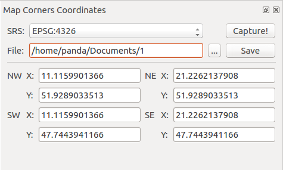

.. Map_Corners_Coordinates documentation master file, created by
   sphinx-quickstart on Sun Feb 12 17:11:03 2012.
   You can adapt this file completely to your liking, but it should at least
   contain the root `toctree` directive.

Welcome to Map Corners Coordinates's documentation!
============================================

Description
***********
This plugin shows coordinates of corners of current map canvas on the screen. Captured coordinates can be saved as .txt file. User may choose the coordinate system between EPSG:4326 and the current one.

Screens of plugin
****************

	    Plugin
|   
.. figure:: output.png

	    Output file
	
